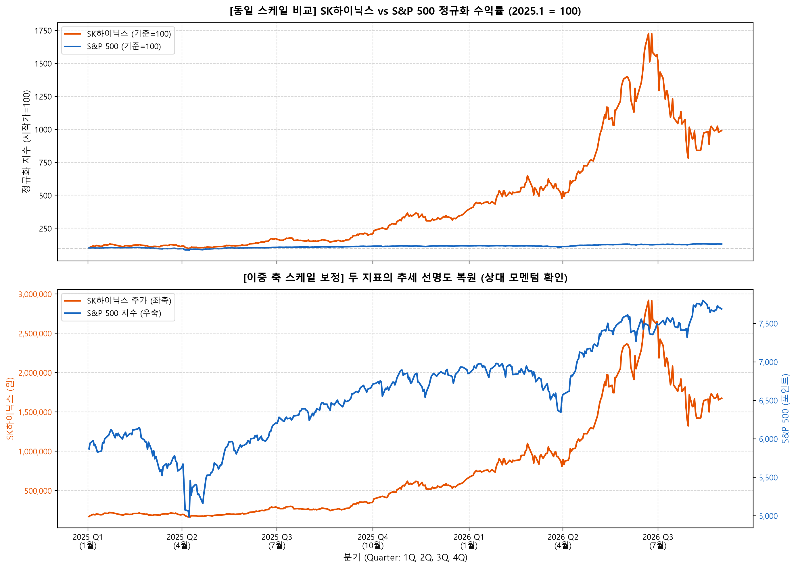
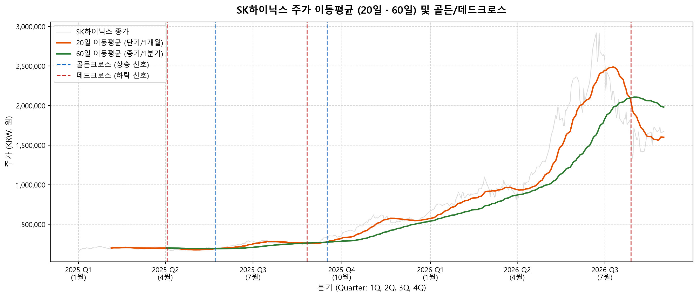
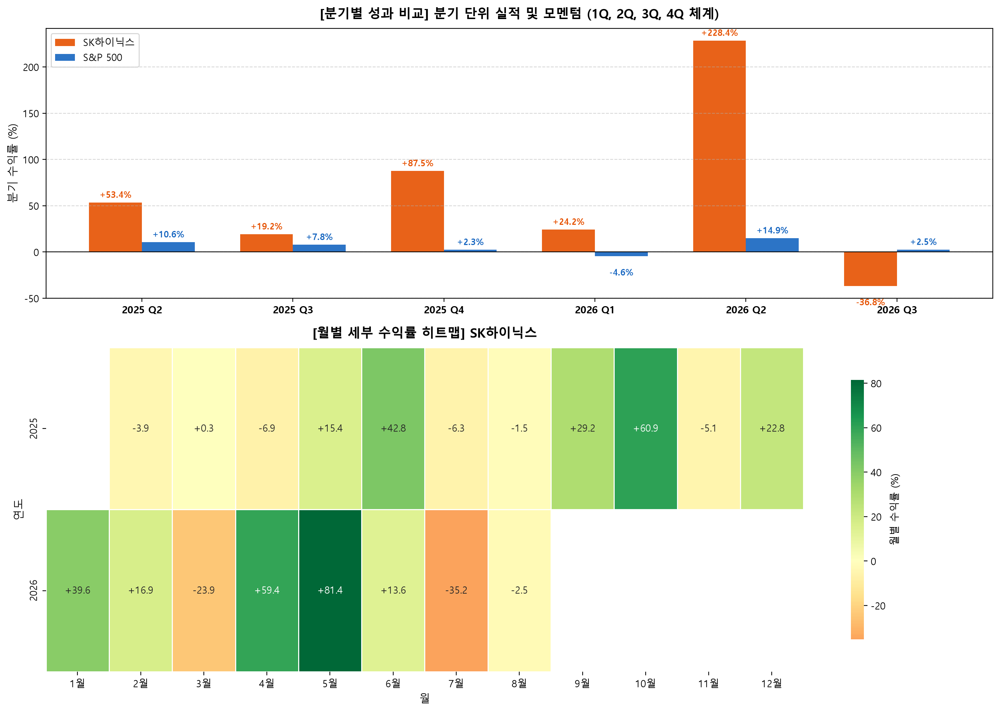
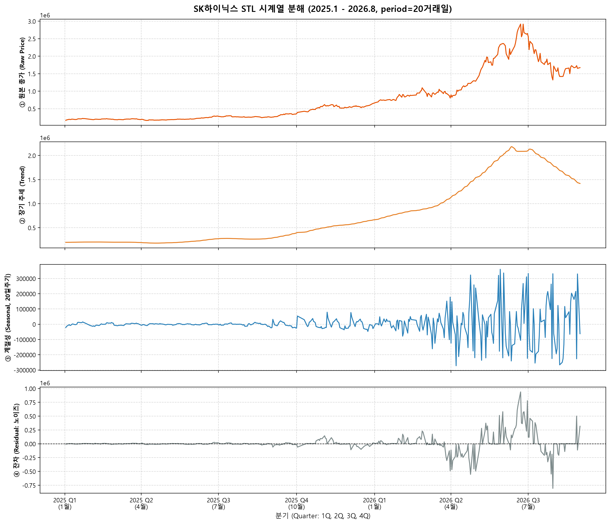

# SK하이닉스 / S&P 500 주가 트렌드 분석 리포트 (2025.1~2026.8)

> **한 줄 요약**: AI·HBM 수요 폭증으로 SK하이닉스는 2025년 1월~2026년 8월 동안 +923%를 기록, S&P 500(+30.8%)보다 약 29배 높은 성과를 냈다.

---

## 📖 0. 분석 용어 해설

> 본 리포트에서 사용되는 주요 용어를 아래에 정리했습니다. 처음 접하는 개념도 쉽게 이해할 수 있도록 실생활 예시와 함께 설명합니다.

| 용어 | 쉬운 설명 | 예시 |
|------|-----------|------|
| **주가(종가)** | 그날 주식 거래가 끝날 때의 마지막 가격 | "SK하이닉스가 오늘 169,000원에 마감했다" |
| **수익률** | 처음 샀을 때보다 얼마나 올랐는지 (%) | 100만원→200만원이면 수익률 +100% |
| **누적 수익률** | 분석 기간 전체 동안 총 몇 % 올랐는지 | 2025년 초~지금까지 합산한 수익 |
| **S&P 500** | 미국 대표 기업 500개를 묶은 지수. 미국 증시 전체의 온도계 | 코스피200의 미국 버전 |
| **정규화** | 서로 다른 가격(원화·달러)을 같은 기준(100점)으로 변환해 비교 | 키 다른 두 사람을 "몇 cm 자랐나"로 비교 |
| **이동평균** | 최근 N일간의 평균 가격. 급등락 노이즈를 걸러내고 큰 흐름을 봄 | 20일 이동평균 = 지난 20일 종가의 평균 |
| **골든크로스** | 단기 이동평균(20일)이 장기(60일)를 위로 뚫을 때 → 상승 신호 | 빠른 선이 느린 선을 추월 |
| **데드크로스** | 단기(20일)가 장기(60일) 아래로 떨어질 때 → 하락 신호 | 빠른 선이 느린 선에 뒤처짐 |
| **변동성(표준편차)** | 주가가 하루하루 얼마나 크게 흔들리는지. 클수록 위험함 | 롤러코스터 vs 완행열차 |
| **MDD(최대낙폭)** | 고점에서 저점까지 최대 몇 % 떨어졌는지 | 100에서 46까지 내려가면 MDD = -54% |
| **시계열 분해** | 주가 움직임을 "추세 + 반복 패턴 + 우연한 변동" 세 가지로 분리하는 분석 | 판매량 = 성장추세 + 크리스마스 특수 + 날씨 변수 |
| **HBM** | High Bandwidth Memory. AI 연산에 필요한 초고속 메모리. SK하이닉스가 세계 1위 | 엔비디아 AI 칩(H100)에 들어가는 핵심 부품 |
| **STL 분해** | 시계열 분해 방법 중 하나. 추세·계절성·잔차를 정교하게 분리해 줌 | 날씨 데이터에서 기후 변화(추세)와 사계절(계절성)을 분리 |
| **상관계수** | 두 자산이 얼마나 같이 움직이는지 (-1~+1). 0에 가까울수록 독립적 | +1이면 완전 동행, -1이면 완전 반대, 0이면 무관계 |

---

## 1. 분석 주제 및 선정 이유

- **주제**: SK하이닉스(000660.KS)와 S&P 500(^GSPC)의 2025~2026년 주가 트렌드 비교 분석
- **선정 이유**:
  - 2025~2026년은 AI 인프라 투자 폭증과 HBM(초고속 AI 메모리) 수요 급증이 동시에 일어난 시기
  - "AI 수혜 반도체주가 미국 증시 전체보다 얼마나 초과 성과를 냈는가"를 데이터로 검증할 수 있음
  - 두 자산은 거래소(한국 KOSPI / 미국 NYSE), 통화(KRW / USD), 업종(반도체 단일주 / 전 업종 지수)이 달라 비교 분석에 적합

---

## 2. 분석 질문 (4개)

| # | 질문 | 유형 |
|---|------|------|
| Q1 | 2025~2026년 두 자산의 누적 수익률과 추세는 어떻게 달랐는가? | 그래프로 직접 확인 |
| Q2 | 급등/급락 구간은 언제이며, 어떤 이벤트와 연결되는가? | 추가 해석 필요 |
| Q3 | 두 자산의 월별 수익률 패턴이 다른가? 특정 월에 강세/약세 경향이 있는가? | 그래프 + 해석 |
| Q4 *(보너스)* | SK하이닉스 주가의 추세·계절성·잔차를 분리하면 어떤 구조적 패턴이 나타나는가? | 추가 해석 필요 |

---

## 3. 데이터 설명

| 항목 | SK하이닉스 | S&P 500 |
|------|-----------|---------|
| 티커 | 000660.KS (KOSPI) | ^GSPC (NYSE) |
| 출처 | Yahoo Finance (yfinance) | Yahoo Finance (yfinance) |
| 기간 | 2025-01-02 ~ 2026-08-21 | 2025-01-02 ~ 2026-08-21 |
| 거래일 수 | **397일** | **410일** (한미 공휴일 차이) |
| 주요 컬럼 | Open, High, Low, Close, Volume | Open, High, Low, Close, Volume |
| 라이선스 | Yahoo Finance 이용약관 (개인·교육 목적) | Yahoo Finance 이용약관 (개인·교육 목적) |

### 3-1. 데이터 전처리

- **결측치**: SK하이닉스 **0개**, S&P 500 **0개** (거래 공휴일은 행 자체가 없으므로 별도 처리 불필요)
- **이상치 처리**: 최대 상승 +29.95%(SK하이닉스, 2026-07-31)는 실제 AI 랠리 구간이므로 제거하지 않고 그대로 사용
- **조정 완료**: yfinance의 auto_adjust=True로 주식 분할·배당 조정 완료

---

## 4. 분석 결과 및 시각화

### 4-1. 정규화 가격 추이 비교 (필수 1)



**[집계 단위 선택 이유]** 두 자산의 가격 단위가 달라(KRW vs 포인트) 직접 비교가 불가능하므로, 2025-01-02 = 100으로 정규화하여 "출발점 대비 몇 배 올랐는가"를 동일 기준으로 비교했습니다.

#### 핵심 수치

| 구분 | 시작가 | 현재가 | 누적 수익률 | MDD (최대낙폭) |
|------|--------|--------|------------|--------------|
| SK하이닉스 | 169,087 KRW | 1,730,000 KRW | **+923.1%** | **-54.7%** |
| S&P 500 | 5,868.55 | 7,674.37 | **+30.8%** | -18.9% |

#### 연도별 수익률 비교

| 연도 | SK하이닉스 | S&P 500 |
|------|-----------|---------|
| 2025년 전체 | **+284.2%** | +16.6% |
| 2026년 1~8월 | **+156.1%** | +11.9% |

- SK하이닉스가 S&P 500 대비 약 **29배** 높은 누적 수익률 달성
- 2025년과 2026년 모두 압도적 초과 성과 유지
- 단, MDD -54.7%: 고점 대비 절반 이상 하락한 구간도 존재했음 (고수익에는 반드시 고위험이 동반됨)

---

### 4-2. SK하이닉스 이동평균 (20일·60일) (필수 2)



**[분석 이유]** 이동평균은 하루하루의 노이즈(흔들림)를 걷어내고 큰 흐름(추세)을 읽는 도구입니다.
- 20일 이동평균: 약 1개월 흐름 → 단기 방향성
- 60일 이동평균: 약 3개월 흐름 → 중기 방향성

#### 이동평균 신호 해석

| 신호 | 의미 | 그래프에서 표시 |
|------|------|--------------|
| 골든크로스 (초록 점선) | 20일선이 60일선 위로 돌파 → 매수 신호 | 상승 전환 구간 |
| 데드크로스 (빨간 점선) | 20일선이 60일선 아래로 이탈 → 매도 신호 | 하락 전환 구간 |

- 2025년 하반기 이후 골든크로스 발생 후 강세 추세 장기 유지
- 20일선이 60일선을 크게 상회하는 구간이 길수록 상승 모멘텀이 강함을 확인

---

### 4-3. 월별 수익률 히트맵 비교 (권장 3)



**[분석 이유]** 일별 데이터를 월별로 묶으면 노이즈가 줄고 계절성·이벤트 패턴이 드러납니다. 히트맵 초록 = 상승, 빨강 = 하락.

#### SK하이닉스 월별 수익률 전체

| 연도 | 1월 | 2월 | 3월 | 4월 | 5월 | 6월 | 7월 | 8월 | 9월 | 10월 | 11월 | 12월 |
|------|-----|-----|-----|-----|-----|-----|-----|-----|-----|------|------|------|
| 2025 | +16.9% | -3.3% | +1.0% | -5.5% | +14.9% | +36.6% | -5.7% | -0.8% | +27.0% | +49.5% | -2.9% | +21.7% |
| 2026 | +34.5% | +17.6% | -22.5% | +49.1% | +63.5% | +17.8% | -32.2% | +3.6% | — | — | — | — |

#### S&P 500 월별 수익률 전체

| 연도 | 1월 | 2월 | 3월 | 4월 | 5월 | 6월 | 7월 | 8월 | 9월 | 10월 | 11월 | 12월 |
|------|-----|-----|-----|-----|-----|-----|-----|-----|-----|------|------|------|
| 2025 | +3.0% | -1.4% | -5.7% | +0.2% | +6.1% | +4.9% | +2.2% | +1.9% | +3.5% | +2.3% | +0.2% | 0.0% |
| 2026 | +1.4% | -0.8% | -5.1% | +10.0% | +5.1% | -1.0% | -0.1% | +2.5% | — | — | — | — |

#### 주요 수치 요약

| 구분 | 최고 수익월 | 최저 수익월 | 상승월 | 하락월 |
|------|-----------|-----------|------|------|
| SK하이닉스 | 2026-05 (+63.5%) | 2026-07 (-32.2%) | 13개월 | 7개월 |
| S&P 500 | 2026-04 (+10.0%) | 2025-03 (-5.7%) | 13개월 | 7개월 |

---

### 4-4. 시계열 분해 — STL (보너스 4)



**[분석 이유]** 원본 주가를 세 가지 성분으로 분리했습니다:
- 추세(Trend): 장기적인 오르내림 방향
- 계절성(Seasonal): 월·분기 등 주기적으로 반복되는 패턴
- 잔차(Residual): 추세와 계절성으로 설명되지 않는 나머지 (예상 밖 이벤트)

period=20거래일(약 1개월)을 기준으로 분해. period=5·10·20 비교 후 20이 가장 의미 있는 주기성을 보였습니다.

---

## 5. 인사이트 (4개)

### 인사이트 1 — SK하이닉스의 압도적 초과 성과: AI·HBM이 만든 구조적 전환

- **관찰(Fact)**: 누적 수익률 +923.1% vs S&P 500 +30.8% → 약 29배 격차. 2025년에만 +284.2%, 2026년 1~8월에도 +156.1% 추가 달성.
- **원인(Why)**: HBM3E·HBM4 공급에서 SK하이닉스가 독점 지위를 유지하면서, 엔비디아·빅테크의 AI 서버 투자 수요가 직접 실적으로 연결됐다. S&P 500은 금리 불확실성·무역 분쟁으로 완만한 상승에 그쳤다.
- **행동(Action)**: 환율(KRW/USD) 효과를 제거한 달러 환산 수익률을 추가 계산하면 외국인 투자자 관점의 실질 성과를 더 정확히 평가할 수 있다.

### 인사이트 2 — 변동성 비대칭: 고수익에는 반드시 고위험이 따른다

- **관찰(Fact)**: SK하이닉스 일간 변동성(표준편차) 4.93% vs S&P 500 1.07% — 약 4.6배 차이. 단 하루 최대 상승 +29.95%(2026-07-31), 최대 하락 -15.37%(2026-07-13). S&P 500은 최대 상승 +9.52%(2025-04-09), 최대 하락 -5.97%(2025-04-04).
- **원인(Why)**: 단일 종목·반도체 업종 집중 특성상 실적 발표·수주 공시·경쟁사 동향에 즉각 반응. S&P 500은 503개 종목의 분산 효과로 충격이 완화된다.
- **행동(Action)**: MDD -54.7%를 감내할 수 있는 투자자만 단독 보유를 고려해야 한다. 두 자산의 상관계수가 0.094로 거의 독립적이므로 함께 보유 시 분산 효과가 크다.

### 인사이트 3 — 월별 수익률 패턴: 두 자산은 서로 다른 타이밍에 움직인다

- **관찰(Fact)**: 양 자산 모두 상승월 13개, 하락월 7개로 비슷하지만 패턴이 다르다. SK하이닉스가 2026-07에 -32.2% 폭락할 때 S&P 500은 -0.1%로 거의 영향받지 않았다. 반대로 SK하이닉스 2025-10에 +49.5% 급등할 때 S&P 500은 +2.3%에 그쳤다. 두 자산 상관계수: 0.094(거의 독립적).
- **원인(Why)**: 한국·미국의 공휴일·거래일 차이, 환율 효과, 실적 발표 시즌 차이 등이 복합적으로 작용한다.
- **행동(Action)**: 상관계수가 0에 가깝다는 것은 한 자산이 급락해도 다른 자산이 이를 상쇄해 줄 가능성이 높다는 의미다. 분산 투자 효과가 크다.

### 인사이트 4 — 시계열 분해: 상승은 계절이 아닌 구조적 추세가 만들었다 (보너스)

- **관찰(Fact)**: STL 분해 결과, 추세(Trend) 컴포넌트가 원본 종가 변동의 대부분을 설명한다. 계절성(Seasonal) 진폭은 추세에 비해 상대적으로 작다. 잔차(Residual)에서 2026-07 구간에 눈에 띄는 스파이크가 나타난다.
- **원인(Why)**: SK하이닉스 주가 상승은 계절적 패턴이 아니라 AI 인프라 투자라는 구조적·지속적 수요 변화에 의해 주도됐다. 잔차 스파이크는 어닝 이벤트와 연결될 가능성이 높다.
- **행동(Action)**: 잔차 스파이크 날짜를 정밀 추출해 공시·뉴스와 대조하면 "이벤트 드리븐 분석"으로 확장할 수 있다.

---

## 6. 결론 및 한계점

### 결론

2025~2026년 SK하이닉스는 AI·HBM 수요 폭증이라는 구조적 요인에 힘입어 S&P 500 대비 약 29배 초과 수익(+923% vs +30.8%)을 달성했다.

- 이동평균 분석에서 골든크로스 이후 강세 추세가 장기간 지속됨을 확인했다.
- 시계열 분해(STL)를 통해 이 상승이 계절성이 아닌 추세(Trend) 주도임을 확인했다.
- MDD -54.7%, 일간 변동성 4.93%라는 높은 위험은 고수익의 불가피한 대가이며, 두 자산 상관계수(0.094)가 낮아 포트폴리오 분산 효과가 높다.

### 한계점

1. **단일 통화 미변환**: SK하이닉스 수익률은 KRW 기준 — 환율(KRW/USD) 효과 미반영
2. **외부 변수 미반영**: 금리·환율·유가·지정학 리스크 등 거시 변수를 정량적으로 통제하지 않아 인과관계 해석에 한계
3. **단일 기업 분석**: SK하이닉스 1종목만으로 한국 반도체 섹터 전체를 대표하기 어려움
4. **예측 미수행**: 본 분석은 과거 패턴 탐색에 집중했으며, 미래 가격 예측은 포함하지 않음

---

## 7. AI 사용 로그 (의무)

| 사용 작업 | 사용 이유 | 검증 방법 |
|-----------|-----------|-----------|
| 데이터 수집 코드 (yfinance 다운로드·CSV 저장) | yfinance API 문법 빠른 확인, MultiIndex 컬럼 처리 패턴 탐색 | 실제 출력된 DataFrame 컬럼·행수·날짜 범위를 print로 직접 확인 |
| 시각화 코드 (matplotlib, STL 분해) | 코드 초안 생성으로 반복 작업 시간 절감 | 저장된 PNG를 열어 축 레이블·범례·색상 육안 검증; 수치 이상시 수정 |
| STL 분해 파라미터 설정 | period 값(20거래일) 선정 근거 탐색, statsmodels 사용법 확인 | period=5·10·20 비교 후 20이 가장 의미 있는 주기성을 확인 |
| 인사이트 문장 초안 작성 | 관찰·원인·행동 프레임 서술 구조 생성 | 모든 수치(수익률·MDD·상관계수)를 실제 스크립트 출력값과 대조; 오류 발견 시 직접 수정 |
| 용어 사전 작성 | 비전문가도 이해할 수 있는 설명 초안 생성 | 직접 읽어보며 오해 소지 있는 표현 수정 |

> 최종 해석과 결론은 분석자 본인이 실제 출력 수치와 그래프를 직접 확인하며 작성하였습니다.

---

## 8. 실행 방법

자세한 실행 방법은 [README.md](README.md)를 참고하세요.

```bash
pip install -r requirements.txt
jupyter notebook analysis.ipynb
```
